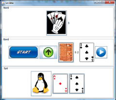

## Prosjekt: Implementasjon av Kortspillet vri-åtter

Vri-åtter er et kortspill som de fleste kjenner og det spilles med en vanlig kortstokk. Hvert kort har en farge (spar, hjerter, ruter og kløver) og en verdi (1,..,13). Verdiene 2,..,10 angis bare med tallverdien, mens de andre kortene har spesielle navn (1 = ess, 11 = knekt, 12 = dame og 13 = konge).

I vår versjon av spillet deltar det nøyaktig to spillere som vi kaller *Nord* og *Syd*. Navnet kommer fra hvordan de plasseres i det grafiske grensesnittet som er vist på figuren nedenfor (Nord øverst, Syd nederst).  

En video som viser eksempel på kjørsel av den ferdige spill-applikasjonen finnes via: https://www.youtube.com/watch?v=F2iQLU5wBXU

### Regler

En av spillerne er giver. Denne spilleren stokker kortene og deler et kort til motstanderen, så et kort til seg selv. Slik holder han/hun på til hver spiller har fått 7 kort. I applikasjonen vil det bli delt ut automatisk når man starter et nytt spill (trykk på *Start*-knappen). Deretter snus øverste kortet og legges med billedsiden opp. Dette blir starten på bunken som spillerne senere spiller sine kort til (vi kaller denne bunken for *til-bunken*). Resten av kortene legges med billedsiden ned og blir bunken som man trekker fra (vi kaller denne bunken for *fra-bunken*). Kortene som en spiller har kalles en *hand*.

En av spillerne starter. Dette vil være den som er til venstre for giver, men i vår versjon med to spillere blir det motstanderen til den som har delt ut kort. Den som er i *tur* kan utføre en *handling*.

Følgene handlingstyper er lovlige

1.	**Legg ned**. Spille et kort til til-bunken. Det er lov å legge ned et kort som er av samme farge eller har samme verdi som kortet som ligger øverst på til-bunken. Det er også lov å spille en vilkårlig åtter. Det spilte kort, ligger nå øverst på til-bunken. Deretter blir det motstanderen sin tur.
2.	**Trekk** Trekke et kort fra fra-bunken. Hvis fra-bunken er tom, må man ta det øverste kort i til-bunken, stokke resten og legge de ned som den nye fra-bunken. I denne forenklede versjon av spillet kan en spiller høyst trekke et kort når det er han/hun sin tur.
3.	**Forbi** Si forbi (pass). Dette er kun lov etter man har trukket ett kort.

Vinneren er den som først blir fri/tom for kort.

### Forenklinger

Vanligvis kan den som spiller en åtter velge hvilken farge som skal spilles neste gang. I vår versjon, må neste spiller fortsette i samme farge som åtteren der ble lagt ned.

**Eksempel:** Nord spiller spar 8. Da må Syd spille spar (eller en ny åtter). Det  er vanlig at man må si fra når man har bare ett kort igjen på hånd, gjerne i kombinasjon med en handling som bank i bordet. Dette vil vi se bort fra i vår versjon.  

Den delvise implementasjon av vri-åtter spillet som dere skal ta utgangspunkt i vil bli/ble gjennomgått på introduksjonsforelesningen.
